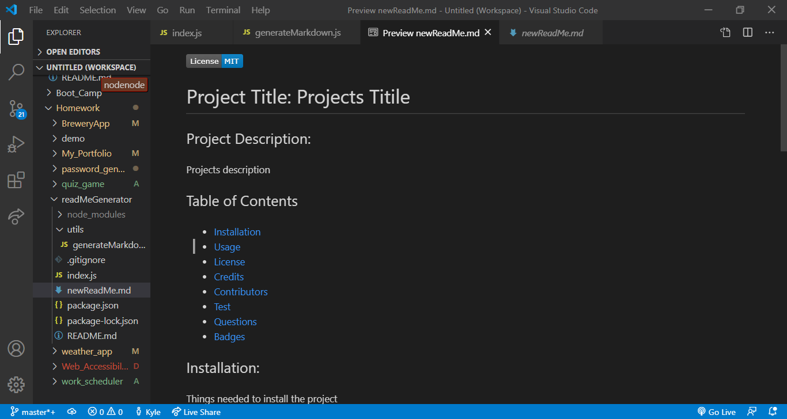
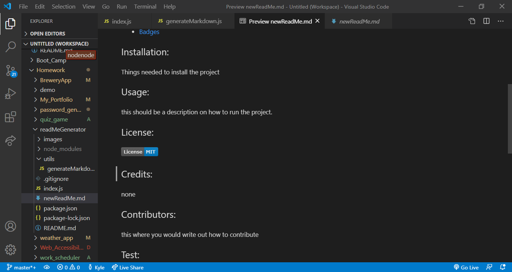
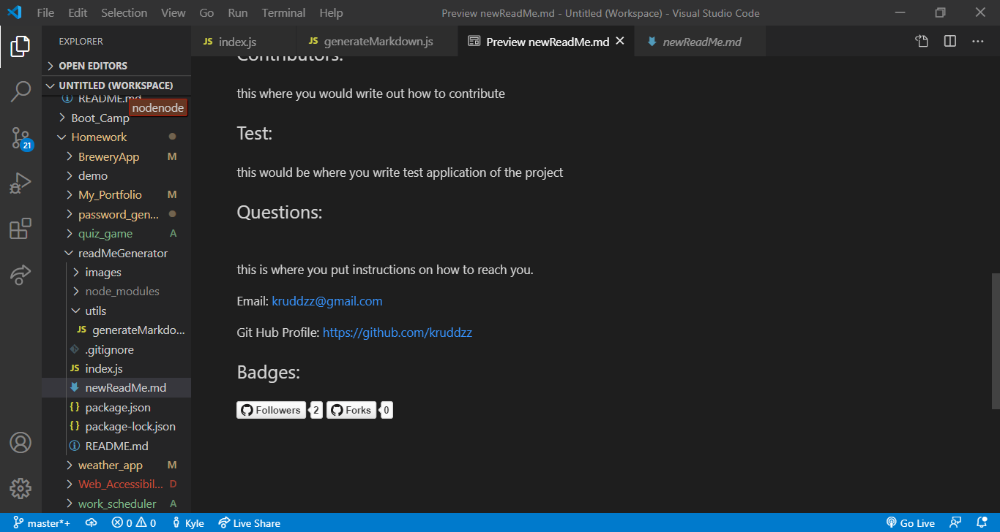

  

  # Project Title: Read Me Generator

  ## Project Description:
 
  A program that asks questions and feeds the answers into a markdown readme file. To create a good readme file for github repos.

  ## Table of Contents
  * [Installation](#installation)
  * [Usage](#usage)
  * [License](#license)
  * [Credits](#credits)
  * [Contributors](#contributors)
  * [Test](#test)
  * [Screenshot](#screenshot) 
  * [Questions](#questions)
  * [Badges](#badges)
  
  ## Installation:
 
  First you will need to clone or fork the repo. Then you have to npm init and then you have to install npm inquirer.

  ## Usage:
 
  Once you have everything installed make sure you are in the readMeGenerator folder. Then enter index.js. Then answer the questions. Then a new readme file should show up in the readMeGenerator folder.

  ## License:
  

  ## Credits:

  Kyle Rudderforth: https://github.com/kruddzz/readMeGenerator
  
  ## Contributors:
  
  https://www.contributor-covenant.org/

  ## Test:
   
  No test

  ## Screenshot:

  
  
  

  ## Video

  https://www.youtube.com/watch?v=DG-odVP_WWE&feature=youtu.be

  ## Questions:
  
  If you have any questions reach out via email or github.
  
  Email: kruddzz@gmail.com
  
  Git Hub Profile: https://github.com/kruddzz

  ## Badges:
  
  

  